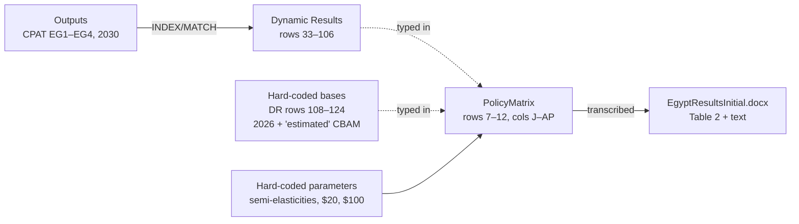

# TASK-2a — Pseudocode of the existing ad hoc (off-CPAT) Egypt calculations

| | |
|---|---|
| Task | TASK-2a (`egypt/instructions/instructions-egypt.yaml`) |
| Version | v0.1, 2026-10-02 (first draft) |
| Describes | `egypt/supporting/InitialResultsAndIssues/AdHocCalculations.xlsb` **as it is** (errors included) |
| Issues source | `egypt/supporting/InitialResultsAndIssues/MajorIssues.docx` (+ item numbers cited in `Methodology/TechnicalNoteonCPATResults_expanded_v2.docx`) |
| Results it feeds | Table 2 of `InitialResultsAndIssues/EgyptResultsInitial.docx` |
| Next step | TASK-2b (corrected calculations) — **not** done here; no model changes made |

This file documents what the workbook does. It does **not** describe what the calculation should do. Wherever the existing logic is wrong, this file reports the existing logic and adds an `⚠` tag that links it to an issue in §2.

---

## 1. Where the calculations live

| Sheet | Role | Used for Table 2? |
|---|---|---|
| `Outputs` (199k rows) | CPAT results dump for scenarios EG1–EG6. The key is `MTCode_Scenario` in column F, and years 2022–2041 are in K:AD. | Source only |
| `Inputs`, `Control` | CPAT scenario definitions (EG1–EG6) | Source only |
| `Dynamic Results` | Looks up selected CPAT outputs for **2030**. Rows 108–124 hold **hard-coded** 2026 "bases". | Yes |
| `PolicyMatrix` | **All the ad hoc arithmetic.** Rows 7–12 = bundles 1A, 2A, 2B, 3A, 3B, 3C. Columns T:AP = calculations. | Yes (cols J–R) |
| `GHG` | Small side table of total, energy, industry and IPPU emissions plus coverage ratios. Its results are not linked by formula; they look like the source of the typed coverage shares. | Indirectly |
| `Matrix Static`, `Matrix Dynamic`, `WIP`, `PSA`, others | Earlier or hidden drafts and helpers. Some contain `#REF!`. | No |

The CPAT legacy CBAM block (rows 12198–12353 of the legacy workbook) is **not used**. None of the workbook's formulas refers to a CBAM output code. All CBAM quantities are typed in (see S2).



Note: almost every link from `Dynamic Results` into `PolicyMatrix` is a **pasted value**, not a formula (e.g. `K8`, `Q8`, `X7`, `AB7`, `AD7`, `AE7`). If CPAT is re-run, the matrix does not update.

---

## 2. Issue register (mapping key)

### 2.1 Issues flagged in MajorIssues.docx

MajorIssues.docx says the technical note contains "a table of 19 flagged issues", and the note's appendix cites "item numbers … in section 4 of the main note". However, `TechnicalNoteonCPATResults_expanded_v2.docx` contains only the appendix. The four opening sections, including the 19-item table, are not in the file or in git history. The six headline flags in MajorIssues.docx are therefore used as the register (MI-1 … MI-6), and wherever the appendix cites an item number it is shown as "TN item n".

| ID | MajorIssues.docx flag (paraphrased) | TN items | Verified against workbook? | Pseudocode steps |
|---|---|---|---|---|
| **MI-1** | Process emissions are **double-counted**, and the appendix's semi-elasticity method was not applied. CPAT scales IPPU with industrial energy CO₂, so 31–38% of each "energy-only" reduction is already process. In 2A/2B this is −12 Mt. 1A then adds another −0.6 Mt on top. | 17 (also 16) | **Yes.** ΔIPPU / ΔGHG in 2030 = −11.96/−38.88 = 30.8% (EG1), −12.56/−41.00 = 30.6% (EG2) and −8.26/−21.54 = 38.4% (EG3). `AL7` = −0.619 Mt is added in `K7`. | S1, S5, S7.1 |
| **MI-2** | 1A is built on **2B** (transfers), not 2A, even though it is described as public-investment recycling. Built on 2A it would give −39.5 Mt and 1,589 deaths. | — | **Yes.** `K7 = K9 + AL7` and `Q7 = Q9·K7/K9`. Using row 8 instead gives −39.50 Mt and 1,588.9 deaths. | S7.1, S10 |
| **MI-3** | 3B cannot be traced: it is a typed-in −13.59 Mt × (2/3)/0.5 = −18.1 Mt. CPAT's own feebate run (EG4) gives −9.6 Mt and is misconfigured: all coverage switches are off and the reduction comes from power. The note's text (13.6 Mt, 5%) and the 345 deaths use the pre-scaling figure, while the table uses −18.1. | 8 | **Yes.** `K11 = (-13.5919999999999)*(2/3)/0.5`. The value 13.592 is not found anywhere in `Outputs`. EG4 has `co2cov.*` = 0 and ΔCO₂ power = −8.63 Mt. `Q11` = 345 ≈ 546 × 13.592/21.542 (pre-scaling). | S7.3, S10 |
| **MI-4** | The −0.549%/$ "half elasticity" cannot be reproduced from any CPAT output in the workbook. The 53.6 Mt CBAM base is "estimated" with no source. | 14, 16 | **Yes.** No `Outputs` value matches 0.0549, 0.1098 or 0.00549. `B118:B122` are typed constants labelled "(estimated)". The process semi-elasticity −0.104%/$ is also typed, and its IPCC A and C values are not recorded. | S2, S3, S5, S7.4 |
| **MI-5** | Base years are mixed. Revenue uses 2026 pre-response emissions, but CPAT's own 2030 figure for EG1 is $6.2 bn, not $5.2 bn. The note's 3A revenue (1.1) matches neither the matrix (2.4) nor CPAT (0.9). | 4, 10 | **Yes.** `V = 20 × AB / 1000` with AB = 2026 values. CPAT 2030 Σ`rev.new.<fuel>.usd.2` = 6.23 (EG1) and 0.93 (EG3). `P10` = 2.37. A value of 1.1 ≈ 20 × 53.6/1000 = 1.07 (likely origin, not confirmed). | S2, S9, S12 |
| **MI-6** | Three different denominators are used for "% of emissions": 249 Mt in the note, 488.7 Mt in the matrix and 594 Mt in CPAT. The 72%/65%/20% coverage shares are typed in rather than computed. | — | **Yes.** `L = K/X` with X = 488.728 (2026), while K is a change in 2030 against a 2030 baseline of 594.156. `J7`/`J8`/`J9` are typed. `J10:J12 = AB/X` = 24.3%, but the note says 20%. `AC` (computed) = 59.0%/53.0% ≠ `J`. The 249 Mt cannot be traced in the workbook. | S4, S11, S12 |

### 2.2 Additional observations found while tracing (not in MajorIssues.docx)

These came out of the cell-by-cell trace. They are listed so that TASK-2b can decide what to do with them. Some may correspond to items in the missing 19-item table.

| ID | Observation | Pseudocode step |
|---|---|---|
| **OBS-1** | The CBAM intensity change is **summed, not share-weighted**: `AK = AG + AI` (energy −5.49% + process −2.08% = −7.57%). Weighting by the 23.9/29.8 Mt fuel/process split would give about −3.6%. Similarly, 2A/2B apply the full energy change (−5.49%) to the whole CBAM intensity even though only 44.5% of CBAM emissions are covered (weighted ≈ −2.4%). This feeds `N` and therefore `O` (obligations). | S5, S6 |
| **OBS-2** | The semi-elasticity is applied **linearly** (`AF × price`), whereas the method states the exponential form `exp(β·τ) − 1`. At $20 the difference is small (−5.49% vs −5.34%). | S5 |
| **OBS-3** | Industrial emissions/output change: for 3A–3C, `T = K / AB`. This divides the **total national** ΔGHG (which includes about −4.7 Mt of non-industry energy CO₂ and all CPAT IPPU) by a covered base that mixes 2030 industry CO₂ with 2026 CBAM process emissions. `U` is then backed out. For 1A/2A/2B, `U` is simply set to 3B's −8.3% and `T` is back-computed from it. | S8 |
| **OBS-4** | `X` and `AB` (2A/2B) are labelled as 2026 baselines but are actually EG1 **policy-scenario** 2026 values (`ghg.tot.inc.2` = 488.728 vs baseline 488.837; `co2.enr.tot.2` = 258.819 vs 258.928). `Dynamic Results` rows 108–111 are typed in and carry `.2` (policy) codes. The difference is small (about 0.1 Mt). | S2 |
| **OBS-5** | `Y` (industry energy CO₂) is the **2030** baseline (88.973), while `AA` (CBAM process) is 2026. `AB10:AB12 = Y + AA` mixes years. Column `Z` ("CBAM Energy related") `= AB10 − AA7` = 88.973 is the industry total, not CBAM fuel (23.85). It is mislabelled but not used downstream. | S2, S4 |
| **OBS-6** | 3C fund: the $20 shadow price goes through the **energy** half-elasticity, is applied to **all 53.6 Mt (including process)**, and is **added** to 3A rather than applied in sequence. | S7.4 |
| **OBS-7** | Deaths in 3B are internally inconsistent: `Q11` = 345 (scaled 3A), but `R11` = 0.002577 = 213/82,651, which is **EG4's** share. The 1A/3C deaths scale with total ΔGHG including process CO₂, which has no air-pollution link (TN item 19). | S10 |
| **OBS-8** | Minor (not in Table 2): `AR8` (EG1 "Total change in revenues (CPAT)") = 10.62, which is EG2's value (EG1 = 10.43). `AS:AU` sit under an "Other/Don't trust" header and are typed. `G7` says "$20 flat from 2027", but the CPAT trajectory starts in 2028. | S9 |

---

## 3. Pseudocode

Conventions:
- `cpat(code, scen, year)` = `INDEX(Outputs!K:AD, MATCH(code&"_"&scen, Outputs!F:F,0), MATCH(year, Outputs!K1:AD1,0))`.
- Suffix `.1` = baseline and `.2` = policy.
- Units are Mt CO₂e, USD bn and USD/t.
- `# cell` gives the workbook location. `⚠ MI-n` / `⚠ OBS-n` links to §2.
- Bundles B ∈ {1A, 2A, 2B, 3A, 3B, 3C} = PolicyMatrix rows 7, 8, 9, 10, 11, 12.

### S0. CPAT scenario runs used

```text
SCENARIO_OF = { 2A: EG1,  # $20 flat from 2028, all sectors, revenue -> public investment
                2B: EG2,  # same, revenue -> per-capita transfers
                3A: EG3,  # industry only, $5 (2028) -> $50 (2034), $20 in 2030
                3B: EG4 } # "Industrial feebate" (label only, see S7.3)
# 1A and 3C have no CPAT run; they are derived (S7).
YEAR = 2030                                          # Dynamic Results row 2
```

### S1. Import CPAT results for 2030 (`Dynamic Results`)

```text
for s in {EG1..EG6}:
    GHG_base[s]   = cpat("egy.mit.ghg.tot.inc.1", s, 2030)        # row 49 (594.156)
    GHG_pol[s]    = cpat("egy.mit.ghg.tot.inc.2", s, 2030)        # row 50
    dGHG[s]       = GHG_pol[s] - GHG_base[s]                      # row 51  (EG1 -38.877, EG2 -41.002, EG3 -21.542, EG4 -9.617)
    deaths[s]     = Σ cpat("egy.air.ada.{2464,65,u24}", s, 2030)  # rows 54-57 (1564, 1631, 546, 213)
    deaths_share[s] = deaths[s] / cpat("egy.air.mort", s, 2030)   # row 59
    net_rev[s]    = cpat("mit.rev.new.usd.2") - cpat("mit.rev.new.usd.1")   # row 42 (10.43, 10.62, 2.69, 6.70)
    # also looked up but only informational: prices, TCP, GDP, co-benefits, distribution (rows 33-101)
    # rows 103-106: 2030 policy GHG, energy CO2, industry CO2, IPPU   (displayed, not linked)

# ⚠ MI-1: dGHG already contains CPAT's IPPU response, because CPAT projects IPPU
#         ∝ industrial energy CO2:  dIPPU/dGHG = 30.8% (EG1), 30.6% (EG2), 38.4% (EG3).
# These values are then TYPED into PolicyMatrix (no formula link):
K[2A] = -38.877 ; K[2B] = -41.002 ; K[3A] = -21.542              # K8, K9, K10
Q[2A] = 1564    ; Q[2B] = 1631    ; Q[3A] = 546                    # Q8, Q9, Q10
R[2A] = 0.018923; R[2B] = 0.019734; R[3A] = 0.006606               # R8, R9, R10
```

### S2. Hard-coded bases (`Dynamic Results` B114:B124 → `PolicyMatrix` X:AE)

```text
# Labelled "Emissions per year MtCO2e, 2026"
X  = TotGHG_2026      = 488.728   # ⚠ OBS-4: EG1 policy value (.2), baseline is 488.837
E26= EnergyCO2_2026   = 258.819   # ⚠ OBS-4: EG1 policy value; baseline 258.928
Y  = IndCO2           =  88.973   # ⚠ OBS-5: this is the 2030 BASELINE, not 2026 (2026 = 77.64)
CBAM_tot  = 53.611430             # B118  ⚠ MI-4: "estimated", no source, no formula
CBAM_fuel = 23.853595             # B119  ⚠ MI-4 (of which cement fuel 15.382, B121)
CBAM_proc = CBAM_tot - CBAM_fuel  # AA = AD9 - AE9 = 29.757835  (cement process 28.064, B122)
# Column Z "CBAM Energy related" = AB10 - AA7 = Y = 88.973   ⚠ OBS-5 mislabelled, unused
```

### S3. Hard-coded parameters

```text
PRICE        = 20                 # W7:W12, $/tCO2 in 2030, all bundles
CBAM_CERT    = 100                # literal "/100" inside the O formula ($/t EU certificate)
beta_E_half  = -0.54896920040469% / 2 = -0.002744846   # AF7:AF12, AN12  ⚠ MI-4 (TN item 14): derivation absent;
                                                        #   "halving" = imposed 50:50 output/intensity split
beta_P       = -0.0010401964469367                      # AH7:AH12  ⚠ MI-4: IPCC A, C not recorded
INCLUDE_PROC = {1A:1, 2A:0, 2B:0, 3A:1, 3B:1, 3C:1}     # AJ
FUND_PRICE   = 20                                       # AM12 (3C only)
```

### S4. Covered base and coverage shares

```text
AB[1A]        = E26 + CBAM_proc          = 288.577   # typed (= DR B124)
AB[2A] = AB[2B] = E26                    = 258.819   # typed (= DR B123)
AB[3A..3C]    = Y + CBAM_proc            = 118.731   # formula; ⚠ OBS-5 mixes 2030 Y with 2026 process
AC[B]         = AB[B] / X                            # 59.0%, 53.0%, 53.0%, 24.3%×3 (computed, not reported)

J[1A] = 0.72 ; J[2A] = J[2B] = 0.65                  # TYPED  ⚠ MI-6 (≠ AC; GHG-sheet ratios use mixed years/denominators)
J[3A..3C] = AB / X = 0.243                           # formula, but the note/Table 2 says "20%"  ⚠ MI-6

AD[B] = CBAM_tot                                     # all bundles
AE[B] = CBAM_fuel  if B in {2A,2B}  else CBAM_tot    # covered CBAM emissions
M[B]  = AE[B] / AD[B]                                # CBAM coverage: 44.5% (2A,2B) else 100%
```

### S5. CBAM-sector emissions-intensity change (columns AF:AK, N)

```text
dI_energy = beta_E_half * PRICE        # AG = -5.490%   ⚠ MI-4; ⚠ OBS-2 linear, not exp(β·τ)-1
dI_proc   = beta_P      * PRICE        # AI = -2.080%   ⚠ MI-4; ⚠ OBS-2
dI_tot[B] = dI_energy + INCLUDE_PROC[B] * dI_proc      # AK
            # ⚠ OBS-1: simple SUM of two % changes, not weighted by fuel/process shares (23.9/29.8);
            #          2A/2B apply -5.49% to the whole CBAM intensity though only 44.5% is covered
N[B] = dI_tot[B]                       # -7.57% (1A,3A,3B), -5.49% (2A,2B)
N[3C] = dI_tot[3C] + AO12              # AO12 = beta_E_half * FUND_PRICE = -5.49%  -> -13.06%  (see S7.4)
# ⚠ MI-1: process intensity cut is applied while CPAT's IPPU row is still included in K
```

### S6. CBAM obligations change (column O)

```text
# Obligation ∝ embedded intensity × (CBAM_CERT − credited domestic price)
for B in {1A,2A,2B,3A,3C}:
    O[B] = N[B] - (1 + N[B]) * PRICE * M[B] / CBAM_CERT
         # ≡ (1+N)·(1 − 0.2·M) − 1  → -26.1% (1A,3A), -13.9% (2A,2B), -30.4% (3C)
O[3B] = N[3B]                          # no price credit under free allocation → -7.6%
# ⚠ OBS-1 flows through N.  Full $20 credited × coverage; no allowance for free-allocation share elsewhere.
```

### S7. Total emissions reduction per bundle (column K)

```text
# 2A, 2B, 3A: straight from CPAT (S1), already include CPAT-scaled IPPU   ⚠ MI-1
K[2A] = dGHG[EG1] ; K[2B] = dGHG[EG2] ; K[3A] = dGHG[EG3]
```

**S7.1 — 1A (“ED1_adjusted”)**
```text
AL7   = CBAM_proc * dI_proc                 # 29.758 × -2.080% = -0.619 Mt  (extra process abatement)
K[1A] = K[2B] + AL7                         # = -41.621   ⚠ MI-2 built on 2B (transfers), not 2A
                                            #             ⚠ MI-1 adds process cut on top of CPAT's IPPU cut
# (on 2A: -38.877 - 0.619 = -39.496)
```

**S7.2 — 3A**: `K[3A] = -21.542` (CPAT EG3, typed).

**S7.3 — 3B (free allocation / OBR)**
```text
K[3B] = (-13.5919999999999) * (2/3) / 0.5   # = -18.123   ⚠ MI-3 typed constant, origin unknown;
                                            #   -13.592 is not any Outputs value; scaling factors undocumented
# CPAT EG4 ("Industrial feebate") is NOT used: dGHG[EG4] = -9.617, coverage switches all 0,
# reduction comes from power (-8.63 Mt CO2), industry CO2 +0.11      ⚠ MI-3 (TN item 8)
```

**S7.4 — 3C (abatement rebate / fund)**
```text
AP12  = beta_E_half * FUND_PRICE * CBAM_tot # -0.2745%/$ × 20 × 53.611 = -2.943 Mt
K[3C] = K[3A] + AP12                        # = -24.485
# ⚠ OBS-6: energy half-elasticity applied to ALL CBAM emissions incl. process; additive, not sequential
# ⚠ MI-4: inherits untraceable beta_E_half and 53.6 Mt base
```

### S8. Industrial emissions and output change (columns T, U; not in Table 2)

```text
for B in {3A,3B,3C}:
    T[B] = K[B] / AB[B]                     # "Industrial emissions change": -18.1%, -15.3%, -20.6%
    U[B] = (1 + T[B]) / (1 + N[B]) - 1      # "Industrial output change":   -11.4%, -8.3%, -8.7%
for B in {1A,2A,2B}:
    U[B] = U[3B]                            # = -8.32%, copied from 3B
    T[B] = (1 + U[B]) * (1 + N[B]) - 1      # back-computed
# ⚠ OBS-3: K is national total (incl. non-industry & all IPPU), AB is covered base with mixed years;
#          1A/2A/2B output change inherits the untraceable 3B number (⚠ MI-3)
```

### S9. Carbon revenues (columns V, P)

```text
V[B] = PRICE * AB[B] / 1000                 # 5.772 (1A), 5.176 (2A,2B), 2.375 (3A..3C)
P[B] = V[B]   for B in {1A,2A,2B,3A}
P[3B] = 0 ; P[3C] = 0                       # value returned to firms → reported as zero
# ⚠ MI-5 (TN items 4,10): base = 2026 pre-response emissions, not 2030 policy-scenario emissions.
#   CPAT 2030 Σ rev.new.<fuel>.usd.2: EG1 = 6.23, EG3 = 0.93 (vs 5.18, 2.37 here)
# Not in Table 2:  AR = typed CPAT net revenue change (AR8 = 10.62 is EG2's, EG1 = 10.43  ⚠ OBS-8)
#                  AU = AR - P  "Fuel subsidy expenditures saved"
```

### S10. Air-pollution deaths avoided (columns Q, R)

```text
Q[2A], Q[2B], Q[3A] = CPAT (S1)
Q[1A] = Q[2B] * K[1A] / K[2B]               # 1655.6  ⚠ MI-2 (2B base); ⚠ OBS-7 scales with process CO2 (TN item 19)
Q[3C] = Q[3A] * K[3C] / K[3A]               # 620.6   ⚠ OBS-7 (scales with fund cut on process too)
Q[3B] = 345                                 # typed; ≈ 546 × 13.592/21.542 = pre-scaling 3B   ⚠ MI-3
R[1A] = R[2B] * Q[1A]/Q[2B] ; R[3C] = Q[3C]*R[3A]/Q[3A]
R[3B] = 0.002577                            # = 213/82651, EG4's share – inconsistent with Q[3B]  ⚠ OBS-7
```

### S11. Emission reductions as % (column L)

```text
L[B] = K[B] / X                             # 2030 change ÷ 2026 total (488.728)
# ⚠ MI-6: CPAT's own % uses the 2030 baseline 594.156 (e.g. EG1 -6.5% vs L8 -7.95%);
#         the Egypt note text uses a third denominator, ~249 Mt (untraceable)
```

### S12. Transcription to EgyptResultsInitial.docx (Table 2 and text)

```text
Table2[B] = round(PolicyMatrix[B, {J,K,M,N,O,P,Q}])   # matches matrix except:
  Table2[3A].revenue = 1.1          # matrix P10 = 2.37; CPAT 0.93       ⚠ MI-5 (1.1 ≈ 20×53.6/1000?)
  Table2.coverage text  3A–3C = "20%" # matrix J = 24.3%                 ⚠ MI-6
  Text: "13.6 to 41.6 Mt ... 5–17% of ~249 Mt"; "3B ... 13.6 MtCO2 (about 5%)"
        # uses pre-scaling -13.59, while Table 2 shows -18.1           ⚠ MI-3, MI-6
  Text: "$20/t from 2028" vs matrix G7 "from 2027"                      ⚠ OBS-8
```

---

## 4. Verification of this pseudocode

The logic in S2–S10 was re-implemented in Python using only the hard-coded inputs listed above. It reproduces every PolicyMatrix output in rows 7–12 (J, K, M, N, O, P, Q, T, U, V) to at least four decimal places:

| Bundle | K (Mt) | M | N | O | P ($bn) | Q | U |
|---|---|---|---|---|---|---|---|
| 1A | −41.621 | 100% | −7.57% | −26.06% | 5.772 | 1,655.6 | −8.32% |
| 2A | −38.877 | 44.5% | −5.49% | −13.90% | 5.176 | 1,564 | −8.32% |
| 2B | −41.002 | 44.5% | −5.49% | −13.90% | 5.176 | 1,631 | −8.32% |
| 3A | −21.542 | 100% | −7.57% | −26.06% | 2.375 | 546 | −11.44% |
| 3B | −18.123 | 100% | −7.57% | −7.57% | 0 | 345 | −8.32% |
| 3C | −24.485 | 100% | −13.06% | −30.45% | 0 | 620.6 | −8.70% |

CPAT cross-checks (2030, from the `Outputs` sheet): EG1/EG2/EG3 ΔIPPU = −11.955 / −12.563 / −8.262 Mt. EG4 has coverage = 0 and ΔCO₂ power = −8.634 Mt. Σ`rev.new.<fuel>.usd.2` = 6.23 (EG1) and 0.93 (EG3). Baseline 2026 total GHG = 488.837 and 2030 = 594.156.

## 5. Open points for TASK-2b

1. Locate the full 19-item issues table. It is referenced in MajorIssues.docx but not present in either document.
2. Find the sources of −13.592 (3B), −0.549%/$ (energy) and −0.104%/$ (process), and of the 53.6 / 23.9 / 29.8 Mt CBAM split. Otherwise they need to be rebuilt from CPAT, preferably from the legacy CBAM block, rows 12198–12353 (TASK-1).
3. Decide on a single base year (2030) and a single denominator for every metric. Replace the pasted values with live links to CPAT outputs.
